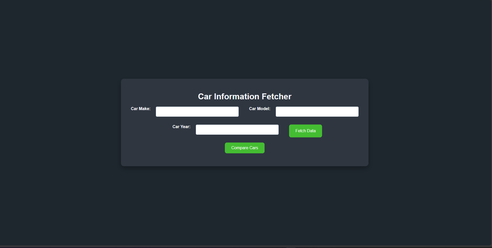
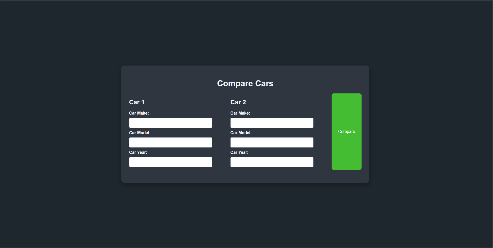

# Car Information and Comparison Website

This project is a web application for fetching and comparing car information. Users can input car details such as make, model, and year to retrieve information or compare two cars side-by-side. The application uses the Flask framework and the API Ninjas car API for data retrieval.

## Table of Contents
- [Features]
- [Technologies Used]
- [Installation]
- [Usage]
- [File Structure]
- [Environment Variables]
- [API Integration]
- [Screenshots]
- [License]

## Features
- Fetch detailed information about a car based on make, model, and year.
- Compare two cars side-by-side with dynamically generated tables.
- Responsive and user-friendly design.
- Uses API Ninjas for real-time car data.

## Technologies Used
- **Backend:** Python, Flask
- **Frontend:** HTML, CSS, Bootstrap (optional for styling improvements)
- **Data Handling:** Pandas
- **API Integration:** API Ninjas car API

## Installation

### Prerequisites
- Python 3.7+
- Pip
- Virtual Environment (recommended)

### Steps
1. **Clone the repository:**
   ```bash
   git clone https://github.com/your-username/Car.git
   cd car-info-comparison
   ```

2. **Set up a virtual environment:**
   ```bash
   python -m venv venv
   source venv/bin/activate   # On Windows, use `venv\Scripts\activate`
   ```

3. **Install dependencies:**
   ```bash
   pip install -r requirements.txt
   ```

4. **Set up the `.env` file:**
   Create a `.env` file in the project root and add your API key:
   ```env
   API_KEY=your_api_key_here
   ```

5. **Run the application:**
   ```bash
   python app.py
   ```

6. **Access the application:**
   Open your browser and go to `http://127.0.0.1:5000/`.

## Usage

### Fetch Car Information
1. Navigate to the main page (`http://127.0.0.1:5000/`).
2. Enter the car's make, model, and year.
3. Click "Fetch Data" to retrieve detailed car information.

### Compare Cars
1. Click on "Compare Cars" or navigate to `/compare`.
2. Enter the make, model, and year for two cars.
3. Click "Compare" to view a side-by-side comparison.

## File Structure
```
.
├── app.py               # Flask application logic
├── templates/           # HTML templates
│   ├── index.html       # Main page template
│   └── compare.html     # Comparison page template
├── static/              # Static files (CSS, images, etc.)
│   └── style.css        # Custom styles
├── .env                 # Environment variables (not included in repo)
└── README.md            # Project documentation
```

## Environment Variables
This project requires an API key from API Ninjas. Store your API key in a `.env` file in the project root.

**Example .env file:**
```env
API_KEY=your_api_key_here
```

## API Integration
The application integrates with the [API Ninjas Car API](https://api-ninjas.com/api/cars) to fetch car data. Ensure you have an active API key to use this service.

### Endpoints Used
- `GET /v1/cars?make=<make>&model=<model>&year=<year>`

### Example Response
```json
[
  {
    "make": "Toyota",
    "model": "Camry",
    "year": 2020,
    "fuel_type": "Gasoline",
    "city_mpg": 29,
    "highway_mpg": 41
  }
]
```

## Screenshots

### Fetch Car Information


### Compare Cars



## License
This project is licensed under the MIT License. You are free to use, modify, and distribute this software as long as the original license is included.

---
Feel free to contribute to the project or report issues by opening a pull request or an issue on GitHub!

