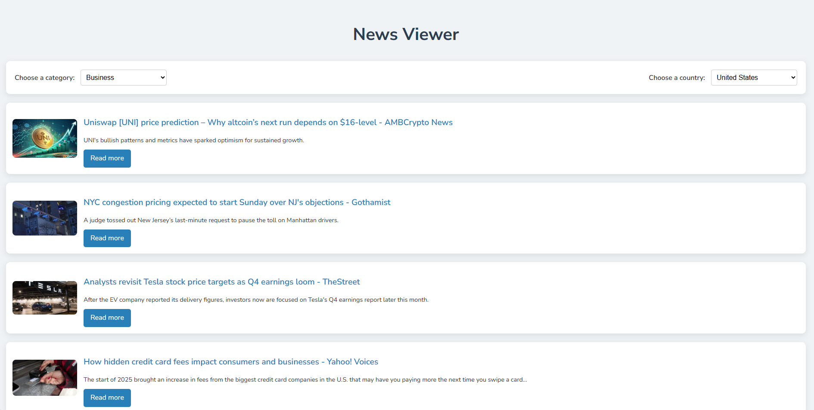

# News Viewer Application

This project is a web application for browsing news articles by category and country. It fetches real-time news data using the NewsAPI and provides a clean, responsive interface for users to view top headlines.

## Table of Contents
- [Features](#features)
- [Technologies Used](#technologies-used)
- [Installation](#installation)
- [Usage](#usage)
- [File Structure](#file-structure)
- [Environment Variables](#environment-variables)
- [API Integration](#api-integration)
- [Screenshots](#screenshots)
- [License](#license)

## Features
- Fetch and display top headlines based on selected category and country.
- Responsive design for optimal viewing on desktop and mobile devices.
- News articles include titles, descriptions, images, and links to full articles.

## Technologies Used
- **Backend:** Python, Flask
- **Frontend:** HTML, CSS (with Google Fonts for improved typography)
- **API Integration:** NewsAPI

## Installation

### Prerequisites
- Python 3.7+
- Pip
- Virtual Environment (recommended)

### Steps
1. **Clone the repository:**
   ```bash
   git clone https://github.com/your-username/news-viewer.git
   cd news-viewer
   ```

2. **Set up a virtual environment:**
   ```bash
   python -m venv venv
   source venv/bin/activate   # On Windows, use `venv\Scripts\activate`
   ```

3. **Install dependencies:**
   ```bash
   pip install -r requirements.txt
   ```

4. **Set up the `.env` file:**
   Create a `.env` file in the project root and add your API key:
   ```env
   API_KEY=your_newsapi_key_here
   ```

5. **Run the application:**
   ```bash
   python app.py
   ```

6. **Access the application:**
   Open your browser and go to `http://127.0.0.1:5000/`.

## Usage

### Browse News
1. Navigate to the main page (`http://127.0.0.1:5000/`).
2. Use the dropdown menus to select a news category and country.
3. View the latest top headlines.
4. Click "Read more" on any article to visit the source.

## File Structure
```
.
├── app.py               # Flask application logic
├── templates/           # HTML templates
│   └── index.html       # Main page template
├── static/              # Static files (CSS, images, etc.)
│   └── (optional)       # Folder for additional assets
├── .env                 # Environment variables (not included in repo)
├── requirements.txt     # Python dependencies
└── README.md            # Project documentation
```

## Environment Variables
This project requires an API key from NewsAPI. Store your API key in a `.env` file in the project root.

**Example .env file:**
```env
API_KEY=your_newsapi_key_here
```

## API Integration
The application integrates with the [NewsAPI](https://newsapi.org/) to fetch news articles. Ensure you have an active API key to use this service.

### Endpoints Used
- `GET /v2/top-headlines?country=<country>&category=<category>&apiKey=<API_KEY>`

### Example Response
```json
{
  "status": "ok",
  "totalResults": 10,
  "articles": [
    {
      "source": { "id": null, "name": "BBC News" },
      "author": "John Doe",
      "title": "Breaking News: Example Title",
      "description": "This is a sample description of the news article.",
      "url": "https://www.bbc.com/example-article",
      "urlToImage": "https://via.placeholder.com/150x150",
      "publishedAt": "2025-01-05T10:00:00Z",
      "content": "This is a sample content snippet of the article."
    }
  ]
}
```

## Screenshots
### Main Page


## License
This project is licensed under the MIT License. You are free to use, modify, and distribute this software as long as the original license is included.

---
Feel free to contribute to the project or report issues by opening a pull request or an issue on GitHub!

