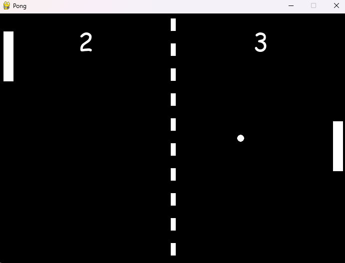

# Pong Game

This project is a Python implementation of the classic Pong game using the Pygame library. The game allows two players to compete in a simple yet engaging paddle-and-ball gameplay experience.

## Table of Contents
- [Features](#features)
- [Technologies Used](#technologies-used)
- [Installation](#installation)
- [Usage](#usage)
- [File Structure](#file-structure)
- [Game Controls](#game-controls)
- [Screenshots](#screenshots)
- [License](#license)

## Features
- Classic Pong gameplay with two paddles and a bouncing ball.
- Two-player support with keyboard controls.
- Scoring system with a customizable winning score.
- Realistic ball physics and paddle collision mechanics.
- Smooth animations and responsive controls.

## Technologies Used
- **Programming Language:** Python
- **Game Development Library:** Pygame

## Installation

### Prerequisites
- Python 3.7+
- Pygame library

### Steps
1. **Clone the repository:**
   ```bash
   git clone https://github.com/your-username/pong-game.git
   cd pongGame
   ```

2. **Set up a virtual environment (optional):**
   ```bash
   python -m venv venv
   source venv/bin/activate   # On Windows, use `venv\Scripts\activate`
   ```

3. **Install dependencies:**
   ```bash
   pip install pygame
   ```

4. **Run the game:**
   ```bash
   python game.py
   ```

## Usage
- Launch the game by running the `pong_game.py` file.
- Two players control the paddles to keep the ball in play and score points against their opponent.
- The first player to reach the winning score wins the game.

## File Structure
```
.
├── game.py               # Main game code
└── README.md             # Project documentation
```

## Game Controls
- **Left Paddle (Player 1):**
  - Move Up: `W`
  - Move Down: `S`
- **Right Paddle (Player 2):**
  - Move Up: `Up Arrow`
  - Move Down: `Down Arrow`

## Gameplay Rules
- The ball bounces off walls and paddles.
- If the ball passes a paddle, the opposing player scores a point.
- The first player to reach the winning score (default: 10) wins.

## Screenshots
### Game Interface


## License
This project is licensed under the MIT License. You are free to use, modify, and distribute this software as long as the original license is included.

---
Feel free to contribute to the project or report issues by opening a pull request or an issue on GitHub!

