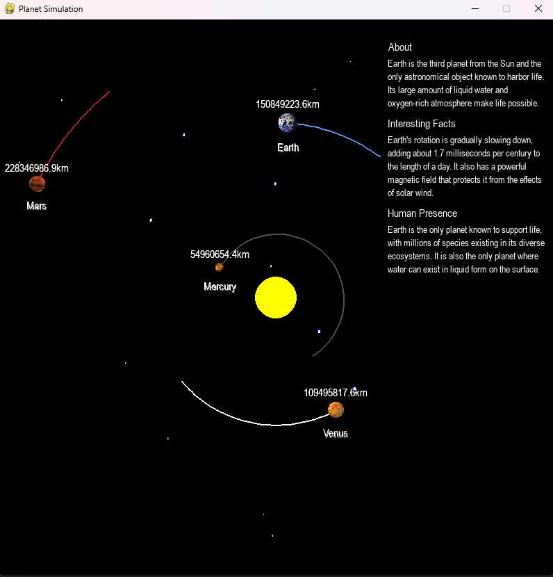

# Solar System Simulation

This project is a simulation of the solar system built using Python and the Pygame library. It allows users to observe the motion of planets in their orbits around the Sun, with a visually appealing and interactive interface.

## Table of Contents
- [Features](#features)
- [Technologies Used](#technologies-used)
- [Installation](#installation)
- [Usage](#usage)
- [File Structure](#file-structure)
- [Simulation Details](#simulation-details)
- [Planet Information](#planet-information)
- [Screenshots](#screenshots)
- [License](#license)

## Features
- Simulates planetary motion based on gravitational forces.
- Realistic scaling of distances and velocities using astronomical units.
- Includes the Sun, Earth, Mars, Mercury, and Venus.
- Interactive menu with detailed information about each planet.
- Scrolling menu for extended information.
- Textures for planets and a starry background for added realism.

## Technologies Used
- **Programming Language:** Python
- **Game Development Library:** Pygame

## Installation

### Prerequisites
- Python 3.7+
- Pygame library

### Steps
1. **Clone the repository:**
   ```bash
   git clone https://github.com/your-username/solarSystem.git
   cd solarSystem
   ```

2. **Set up a virtual environment (optional):**
   ```bash
   python -m venv venv
   source venv/bin/activate   # On Windows, use `venv\Scripts\activate`
   ```

3. **Install dependencies:**
   ```bash
   pip install pygame
   ```

4. **Add textures and background images:**
   - Place images for planets (e.g., `earth_texture.png`, `mars_texture.png`) in the project directory.
   - Place the background image (e.g., `starback.jpg`) in the project directory.

5. **Run the simulation:**
   ```bash
   python main.py
   ```

## Usage
- Launch the simulation by running the `main.py` file.
- Left-click on a planet to view detailed information in the menu.
- Use the scroll wheel to navigate through the menu.
- Observe the orbits of planets in real-time.

## File Structure
```
.
├── main.py                # Main simulation code
├── earth_texture.png      # Texture for Earth
├── mars_texture.png       # Texture for Mars
├── mercury_texture.png    # Texture for Mercury
├── venus_texture.png      # Texture for Venus
├── starback.jpg           # Background image
└── README.md              # Project documentation
```

## Simulation Details
- **Physics:**
  - Gravitational forces between planets and the Sun are calculated using Newton's law of gravitation.
  - Velocities and positions are updated at each timestep.
- **Scaling:**
  - Distances are scaled from astronomical units (AU) to pixels.
  - Time progresses in one-day increments.
- **Visuals:**
  - Planets leave trails to visualize their orbits.
  - Textures are applied to enhance realism.

## Planet Information
Each planet has unique details, including:
- **Sun:**
  - Description: A nearly perfect sphere of hot plasma at the center of the solar system.
  - Interesting Fact: Contains 99.86% of the solar system's mass.
- **Earth:**
  - Description: The only planet known to harbor life.
  - Interesting Fact: Its rotation is gradually slowing down.
- **Mars:**
  - Description: Known as the "Red Planet" due to iron oxide on its surface.
  - Interesting Fact: Home to the tallest volcano, Olympus Mons.
- **Venus:**
  - Description: Earth's "sister planet" due to similar size and mass.
  - Interesting Fact: Has a thick, toxic atmosphere.
- **Mercury:**
  - Description: The smallest planet and closest to the Sun.
  - Interesting Fact: A day on Mercury lasts 176 Earth days.

## Screenshots
### Planetary Orbits


## License
This project is licensed under the MIT License. You are free to use, modify, and distribute this software as long as the original license is included.

---
Feel free to contribute to the project or report issues by opening a pull request or an issue on GitHub!

