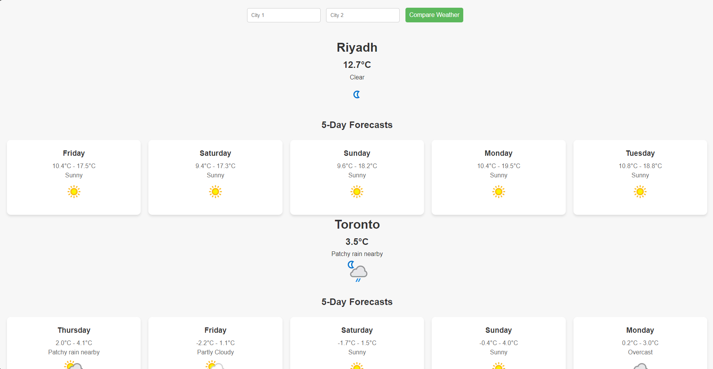

# Weather Application

This project is a full-stack weather application built with Django. It allows users to view real-time weather information for various locations. The application utilizes a clean architecture with Django at its core and integrates with a weather API to fetch live data.

## Table of Contents
- [Features](#features)
- [Technologies Used](#technologies-used)
- [Installation](#installation)
- [Usage](#usage)
- [File Structure](#file-structure)
- [API Integration](#api-integration)
- [Screenshots](#screenshots)
- [License](#license)

## Features
- Users can enter a city name to view real-time weather data.
- Weather data includes temperature, humidity, and other relevant details.
- User-friendly interface with a responsive design.
- Implements Django's MVC (Model-View-Controller) architecture.

## Technologies Used
- **Backend:** Django (Python)
- **Frontend:** HTML, CSS
- **Database:** SQLite
- **API Integration:** OpenWeatherMap (or another weather API)

## Installation

### Prerequisites
- Python 3.7+
- Django 4.x
- API Key from a weather service (e.g., OpenWeatherMap)

### Steps
1. **Clone the repository:**
   ```bash
   git clone https://github.com/your-username/weather-app.git
   cd weather-app
   ```

2. **Set up a virtual environment (optional):**
   ```bash
   python -m venv venv
   source venv/bin/activate   # On Windows, use `venv\Scripts\activate`
   ```

3. **Install dependencies:**
   ```bash
   pip install -r requirements.txt
   ```

4. **Configure the API key:**
   - Add your API key to the `API_KEY` file in the root directory.

5. **Apply database migrations:**
   ```bash
   python manage.py migrate
   ```

6. **Run the development server:**
   ```bash
   python manage.py runserver
   ```

7. **Access the application:**
   Open your browser and navigate to `http://127.0.0.1:8000/`.

## File Structure
```
weather_project/
├── weather_app/
│   ├── migrations/          # Database migrations
│   ├── static/              # Static files (CSS, JavaScript, images)
│   │   └── style.css        # Stylesheet for the application
│   ├── templates/           # HTML templates
│   ├── __init__.py          # Python package initializer
│   ├── admin.py             # Admin interface configuration
│   ├── apps.py              # App configuration
│   ├── models.py            # Data models
│   ├── tests.py             # Unit tests
│   ├── urls.py              # App-specific URL routing
│   ├── views.py             # Application logic and controllers
├── weather_project/
│   ├── __init__.py          # Python package initializer
│   ├── asgi.py              # ASGI configuration
│   ├── settings.py          # Project settings
│   ├── urls.py              # Project-wide URL routing
│   ├── wsgi.py              # WSGI configuration
├── .gitignore               # Git ignored files
├── API_KEY                  # File to store the API key
├── db.sqlite3               # SQLite database
├── manage.py                # Django project management script
```

## API Integration
The application fetches weather data using a third-party API. Ensure you have an API key to use the service.

### Configuring the API Key
1. Register on a weather API provider (e.g., [OpenWeatherMap](https://openweathermap.org/)).
2. Obtain an API key.
3. Add the key to the `API_KEY` file in the root directory.

### API Request Example
- **Endpoint:** `https://api.openweathermap.org/data/2.5/weather?q=<city>&appid=<API_KEY>`
- Replace `<city>` with the city name and `<API_KEY>` with your API key.

## Screenshots

### Weather Results


## License
This project is licensed under the MIT License. You are free to use, modify, and distribute this software as long as the original license is included.

---
Feel free to contribute to the project or report issues by opening a pull request or an issue on GitHub!

